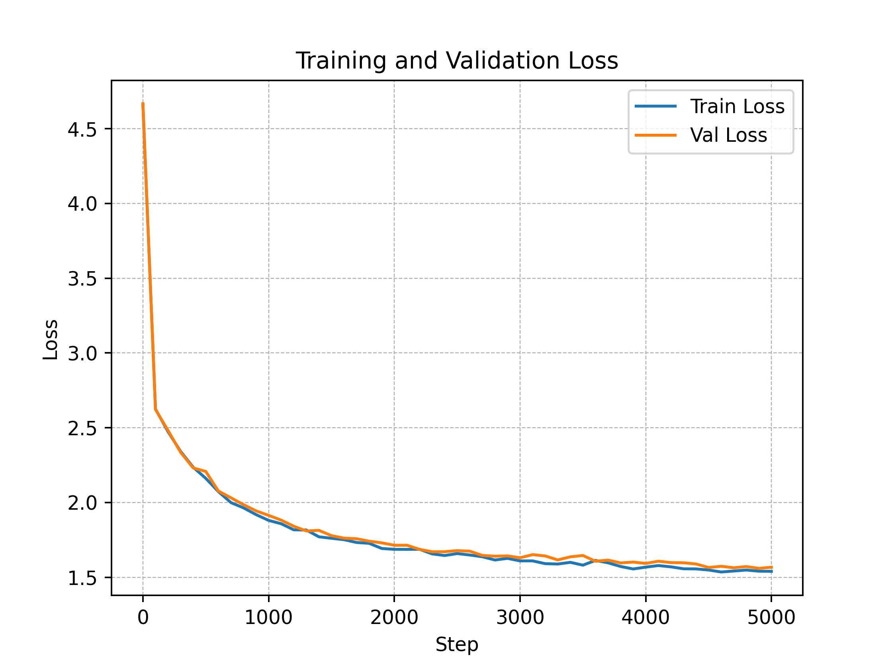

# Building and Analyzing Transformer-Based Language Models

This project provides a comprehensive exploration of the Transformer architecture. It is divided into two main sections:

1.  A **theoretical analysis** of a standard Transformer's architectural components, including calculations for output dimensions and parameter counts.
2.  A **practical implementation** of a character-level, GPT-style (decoder-only) language model from scratch to generate text.

-----

## Part 1: Transformer Architecture Analysis

This section deconstructs a standard Transformer model to understand its internal workings.

### Objective

The goal was to calculate the output dimensions after each sub-layer and the total number of trainable parameters for a given large-scale Encoder-Decoder Transformer architecture.

### Output Dimension Flow

For an input tensor of shape `(batch_size, sequence_length, embedding_dim)` or `(32, 4096, 768)`, the dimensions change as follows through a single encoder block:

1.  **Multi-Head Attention:** The `768` embedding dimension is split across 6 attention heads, giving each head a dimension of `128`.
      - The scaled dot-product attention score matrix has a shape of `(32, 4096, 4096)`.
      - The output of a single head is `(32, 4096, 128)`.
2.  **Concatenation & Projection:** The outputs of the 6 heads are concatenated and passed through a final linear layer, returning the shape to `(32, 4096, 768)`.
3.  **Feed-Forward Network:** The FFN first projects the dimension down (`768 -> 384`) and then projects it back up (`384 -> 768`).
4.  **Residuals & Layer Norm:** These operations do not change the tensor's dimensions.

The final output shape of one encoder block remains `(32, 4096, 768)`, identical to the input.

### Parameter Calculation

The total number of parameters for the specified architecture is **64,951,016**. The breakdown is as follows:

| Component                 | Number of Parameters |
| ------------------------- | -------------------- |
| Embedding & Projection    | 1,811,200            |
| 6 Encoder Blocks          | 18,625,536           |
| 8 Decoder Blocks          | 43,745,280           |
| Final Linear Output Layer | 769,000              |
| **Total** | **64,951,016** |

-----

## Part 2: Implementing a Character-Level GPT Model

### Objective

This section involved building a small, decoder-only Transformer from the ground up to generate new dialogue in the style of the TV show "Friends."

### Methodology

  - **Model:** A 4-layer, 4-head decoder-only Transformer was implemented. It uses a 64-dimensional embedding space and a context window (`block_size`) of 32 characters.
  - **Data:** The model was trained on the "Friends" TV show script, using character-level tokenization. This means the model learns to predict the next character in a sequence.
  - **Training:** The model was trained for 5,000 iterations using the Adam optimizer and Cross-Entropy loss. The training was stable and converged well, achieving a final validation loss of **1.56**.




### Generated Text Samples

The model can generate text autoregressively. Below are samples generated with different initial prompts.

**1. Sample with an Empty Prompt:**

```
Well, The storight, there, don't were. If'm what this watching it farked a too....chat ittin' an youriour.
Holeeed a maselieve? And A undershing; oney, he's a good a lix! Whave wow is a talking.
So, why don't wat whit worring.
MDcIbome, so says. You know it there. A so one Chandler.
```

**2. Sample with Prompt "monica:":**

```
monica: Remay! If a get to we lave? But tonight for from a still. I! Yeah, souy!
We are starts. Phoebe? Don't gonna care which she talking it aftinger a *irtros. Dow, you guys!
Ross, see so you great and away don't know apartment, entely loves you grab! No?
What we just, preetieliel, I know, I know or, is Manachel we're enge would've ready weirdin't prebates you water. Yeahing.
```

**3. Sample with Prompt "Chandler:":**

```
Chandler:) "Eh, love I chinge? Oh, don't would really youh now cept of
fivingling. [Scene: The Ross Joey pre-and-Mw! Hobe to you. 'Sustaugh insits
and not? No! Who have the iosineff, the gonna beding me to.) Well, she's made
thughoughting I don't prese from pool is a Mavilly are acteting, this I'm
throuse, that's just told name. Oh smidgrol your redroom, you salle sreast she.
```

### Analysis

The generated text shows that the model has successfully learned to form words and basic sentence structures. When prompted with a character's name, it attempts to generate dialogue in their style. However, due to its small size, character-level approach, and limited training, the output contains spelling mistakes and grammatical errors. Despite these limitations, the model demonstrates a foundational understanding of the language patterns in the dataset.